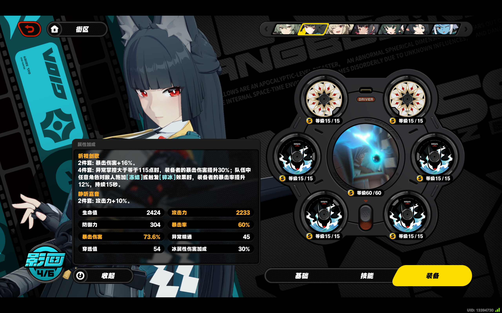
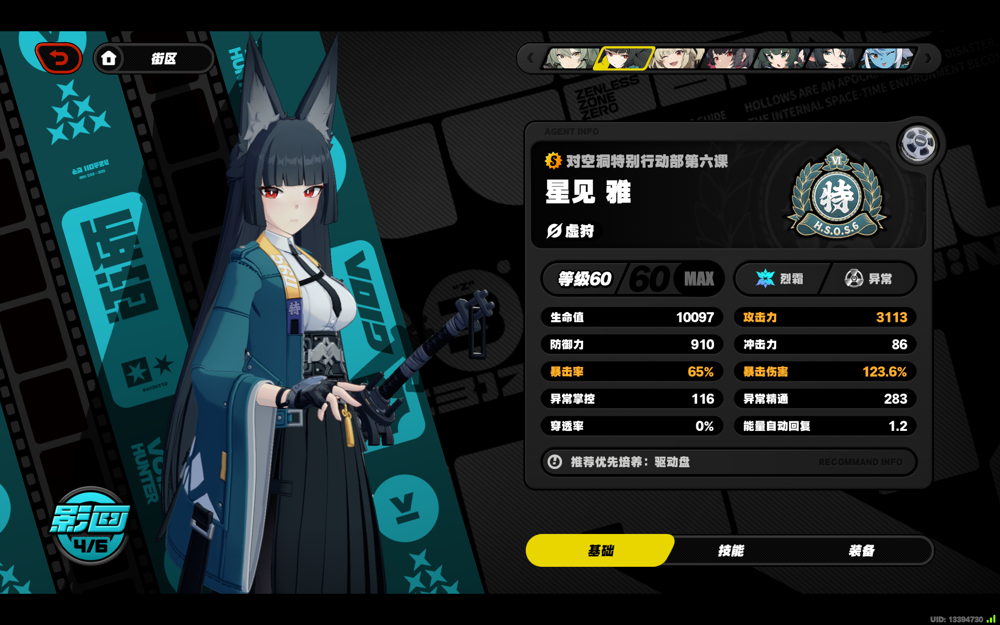
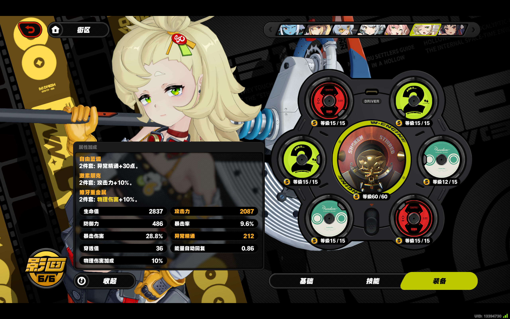

# Readme

这是一个python脚本程序，根据配置文件提供可选驱动盘的信息与搭配方案筛选标准，来自动化搜索、计算并筛选出符合评价标准的驱动盘搭配方案。

# 效果展示（我的雅小姐最佳配盘 OvO）

出乎意料地，四号位选了大攻击而非暴击率，暴击率靠其他盘给堆上去了。

```
Usage: python main.py <config_file>
using default configpath (config.json)
Search completed in 3.4415 seconds
found 1 valid combinations :

[combination 1]
  eq: 'Hailstorm Shrine', slot: 0, set: 'W-Engine'
  eq: 'a_1_02', slot: 1, set: 'Astral Voice'
  eq: 'b_2_05', slot: 2, set: 'Branch & Blade Song'
  eq: 'b_3_06', slot: 3, set: 'Branch & Blade Song'
  eq: 'b_4_02', slot: 4, set: 'Branch & Blade Song'
  eq: 'b_5_03', slot: 5, set: 'Branch & Blade Song'
  eq: 'a_6_01', slot: 6, set: 'Astral Voice'
  eq: 'Astral Bonus', slot: 7, set: 'Bonus'
  eq: 'Branch Bonus', slot: 8, set: 'Bonus'
  final stats:
    ATK: 3113.10
    CRIT Rate: 65.00
    CRIT DMG: 123.60
    PEN: 54.00
```

详细信息

```
[combination 1]
  eq: 'Hailstorm Shrine', slot: 0, set: 'W-Engine', stats: {'CRIT Rate': 24}
  eq: 'a_1_02', slot: 1, set: 'Astral Voice', stats: {'HP': 2200, 'PEN': 9, 'CRIT Rate': 7.2, 'CRIT DMG': 9.6, 'Anomaly Proficiency': 18}
  eq: 'b_2_05', slot: 2, set: 'Branch & Blade Song', stats: {'ATK': 316, 'CRIT DMG': 4.8, 'CRIT Rate': 7.2, 'DEF': 45, 'HP': 112}
  eq: 'b_3_06', slot: 3, set: 'Branch & Blade Song', stats: {'DEF': 184, 'PEN': 27, 'Anomaly Proficiency': 9, 'CRIT DMG': 14.4, 'CRIT Rate': 2.4}
  eq: 'b_4_02', slot: 4, set: 'Branch & Blade Song', stats: {'ATK@': 30, 'ATK': 38, 'CRIT Rate': 7.2, 'HP': 112, 'CRIT DMG': 14.4}
  eq: 'b_5_03', slot: 5, set: 'Branch & Blade Song', stats: {'Ice DMG Bonus': 30, 'CRIT Rate': 4.8, 'Anomaly Proficiency': 9, 'DEF': 45, 'CRIT DMG': 14.4}
  eq: 'a_6_01', slot: 6, set: 'Astral Voice', stats: {'ATK@': 30, 'PEN': 18, 'DEF': 30, 'CRIT Rate': 7.2, 'Anomaly Proficiency': 9}
  eq: 'Astral Bonus', slot: 7, set: 'Bonus', stats: {'ATK@': 10}
  eq: 'Branch Bonus', slot: 8, set: 'Bonus', stats: {'CRIT DMG': 16}
  final stats:
    ATK: 3113.10
    CRIT Rate: 65.00
    CRIT DMG: 123.60
    PEN: 54.00
```





# 实现说明：

* 驱动盘搭配环境
  * 有六个槽位可以装载驱动盘（[1]-[6]），每个位置只能装载属于对应位置的驱动盘。
  * 一个槽位最多只能装载一个驱动盘。
  * 玩家本身各属性有个初始值（由配置文件给出），有的驱动盘属性加成是按百分比加成的，乘的基数是音擎在初始值基础上加成之后的数值。
  * 玩家的属性有如下16种：
    * 生命值
    * 攻击力
    * 防御力
    * 穿透值
    * 暴击率
    * 暴击伤害
    * 异常精通
    * 一场掌控
    * 穿透率
    * 冲击力
    * 能量自动回复
    * 物理伤害加成、火属性伤害加成、冰属性伤害加成、电属性伤害加成、以太伤害加成
  * 玩家还可装备一个“音擎”，也会提供一些属性加成（由配置文件给出），但我们认为“音擎”是固定的，这些加成不会改变。
    * 注意有的驱动盘属性加成是按百分比加成的，乘的基数是音擎在初始值基础上加成之后的数值。
    * 音擎的属性也可能会有百分比加成，具体属性种类（19种）和驱动盘的一样。
    * 音擎的高级属性（与基础属性不同）有可能为百分比（攻击、防御、生命值），此时乘的基数是初始值加上主词条的值。（这与驱动盘的规则不同）
* 驱动盘属性（由配置文件给出）
  * 有不同所属套装（以字符串区分，字符串不包含空白符（空格等），除此以外没其他要求）
    * 装载的驱动盘中，属于特定套装的驱动盘数量达到一定值时会有额外加成。所以我们需要关心的是装载的驱动盘中各套装的驱动盘有多少。
  * 有不同所属槽位（[1]~[6]）
    * 每个驱动盘都有一个固定的所属槽位，它只能装载到对应的槽位中。
  * 有不同属性（19种），都为标量数值
    * 生命值、生命值百分比
    * 攻击力、攻击力百分比
    * 防御力、防御力百分比
    * 穿透值
    * 暴击率
    * 暴击伤害
    * 异常精通
    * 一场掌控
    * 穿透率
    * 冲击力
    * 能量自动回复
    * 物理伤害加成、火属性伤害加成、冰属性伤害加成、电属性伤害加成、以太伤害加成

* 评价标准
  * 评价标准为类似这样的约束：
    * 属性值约束（约束特定属性的值大小）
      * 攻击力 > 3000
      * 穿透率 > 40
    * 套装约束（约束属于特定套装的驱动盘数量）
      * 套装A 最少个数为 4
      * 套装B 最少个数为 2
* 程序目标
  * 程序会给出（所有）满足评价函数约束的搭配方案。
  * 最简单的方法就是暴力搜索，枚举六个位置分别装载哪一个驱动盘，然后计算是否符合评价函数，若符合则将其加入答案集合中。实际用下来感觉效率还行，毕竟规模不大，凹了几天的雅盘，有五十多个了，一秒左右能搜索完。
  * 我并没有在程序中硬编码写出各个属性的值，而是让程序通过配置文件自动适应需要的属性名称。（配置文件中没出现的属性也就不需要考虑了）
  * （感谢ChatGPT，基本上我把上面的需求给出来，再调教一下代码风格，它就给写出来了）

# 配置文件格式

使用 json 配置文件。

* `player` 段：字典
  * `initial_stats`：字典
    * Key 为字符串，代表属性名称。
    * Value 为数值，代表属性值。
    * 可以只写自己关心的属性，不需要将所有属性都写上。不过注意的是当驱动盘加成中包含百分比（如攻击力百分比，但暴击率那种百分比不算）时，要求这段必须有初始值。驱动盘的属性段也是一样，不需要将所有加成都写上，写自己关心的就行。
* `equipment` 段：List
  * `name`：字符串，无特别约束，自己能分得清是哪个就行。
  * `slot`：整数
    * `0` 代表音擎（这点要注意，因为音擎的加成计算是在驱动盘之前的）
    * `1` 至 `6` 分别代表驱动盘六个位置。
    * `7` 即之后的数值没做要求，可自由安排。（例如自行安排驱动盘套装加成，这个加成是和驱动盘在同一阶段计算的。需要注意的是每个 slot 最多装载一个装备，也就是要是准备了多个套装加成，需要设置不同的 slotid）
  * `set`：字符串
    * 对于 `slot` 是 `0` 至 `6` 的，该字段代表驱动盘的套装名称。作用在于后面可以按套装名称约束套装盘个数。
    * 对于其他 `slot` 值的，无特别要求，可以用来自己写点小记号。
  * `base_stats`：字典（可选项）
    * 基础属性加成，具体内容见 `stats` 项后半部分的说明
  * `stats`：字典
    * Key 为字符串，代表属性加成名称（除了百分比的、词条重复等特殊情况，其它情况应与 `player.initial_stats` 段（如果有的话）的名称相同）。
    * Value 为数值，代表该项的值。
    * 对于血量百分比、攻击力百分比、防御力百分比等需要乘白值基数的，Key 末端要加上字符 `'@'`（如 `ATK@`、`攻击力@`），Value 为百分号前的数字。（目前为止需要用百分比乘白值基数的也就是这三项）
    * 对于主词条和副词条名称重复的，有两种选择
      * 一种是自己算算和在一个 key-value 对中
      * 另一种是可以在其中一个前端加上若干`'_'`以区分，程序中会过滤 key 前端的 `'_'` 符号。
    * **有个关于音擎属性的小 bug，目前只能通过手动调整配置文件了。**
      * 音擎加成分为**基础属性**加成和**高级属性**加成，经过测试，发现只有基础属性加成这部分是提前计算的，而高级属性部分是和驱动盘在同一个阶段计算的（与驱动盘百分比乘的是同一个基数，白板属性 + 基础属性加成）。一开始没测试到相应驱动盘，没发现。
      * ~~解决方案是 `slot 0` 处的音擎 `stat` 段只写基础属性加成，在冗余 `slot` 再加上音擎的百分比高级属性加成。（这导致了一个后果，只能固定地选一个音擎了）~~
      * 修改了代码，在配置文件中多了一个可选项 `base_stats`，这项里面的属性加成是在基础属性阶段计算的。
* `constraints` 段：字典
  * `stat_constraints` ：字典
    * `"属性名称" : "属性约束"`
    * 其中属性约束目前只支持 `">num"`、`"<num"`、`">=num"`、`"<=num"` 四种
  * `set_constraints` ：字典
    * `"套装名称" : 最少数量`
    * 用法：约定了套装的最少数量后，便可确保触发套装效果，此时在 `equipment` 段的冗余 slot 加一些虚拟驱动盘表示套装加成，`set` 属性设置为诸如 `套装加成` 之类的词语，在此处加上套装加成的最少数量，即可保证生成的驱动盘配比数值计算正确。（具体可以看配置文件样例）

## 配置文件样例1

```
{
    "player": {
        "initial_stats": {
            "HP": 7673,
            "ATK": 880,
            "DEF": 606,
            "Impact": 86,
            "CRIT Rate": 5,
            "CRIT DMG": 50,
            "Anomaly Mastery": 116,
            "Anomaly Proficiency": 238,
            "PEN Ratio": 0,
            "PEN": 0,
            "Energy Regen": 1.2,
            "Energy Generation Rate": 0,
            "Energy Limit": 120,
            "Physical DMG Bonus": 0,
            "Fire DMG Bonus": 0,
            "Ice DMG Bonus": 0,
            "Electric DMB Bonus": 0,
            "Ether DMB Bonus": 0
        }
    },

    "equipment": [
        {
            "name": "霞落星殿",
            "slot": 0,
            "set": "音擎",
            "basic_stats": {
                "ATK": 743
            },
            "stats": {
                "CRIT Rate": 24
            }
        },

        {
            "name": "b_1_01",
            "slot": 1,
            "set": "Branch & Blade Song",
            "stats": {
                "HP": 2200,
                "DEF@": 4.8,
                "CRIT Rate": 9.6,
                "ATK": 38,
                "CRIT DMG": 9.6
            }
        },
        {
            "name": "b_1_02",
            "slot": 1,
            "set": "Branch & Blade Song",
            "stats": {
                "HP": 2200,
                "CRIT DMG": 14.4,
                "ATK@": 6,
                "Anomaly Proficiency": 9,
                "DEF": 30
            }
        },
        {
            "name": "a_1_01",
            "slot": 1,
            "set": "Astral Voice",
            "stats": {
                "HP": 2200,
                "ATK@": 6,
                "PEN": 36,
                "CRIT Rate": 2.4,
                "Anomaly Proficiency": 9
            }
        },

        {
            "name": "b_2_01",
            "slot": 2,
            "set": "Branch & Blade Song",
            "stats": {
                "ATK": 316,
                "ATK@": 12,
                "CRIT Rate": 2.4,
                "HP@": 6,
                "PEN": 9
            }
        },
        {
            "name": "a_2_01",
            "slot": 2,
            "set": "Astral Voice",
            "stats": {
                "ATK": 316,
                "CRIT Rate": 4.8,
                "DEF@": 9.6,
                "ATK@": 6,
                "PEN": 18
            }
        },

        {
            "name": "b_4_01",
            "slot": 4,
            "set": "Branch & Blade Song",
            "stats": {
                "CRIT Rate": 24,
                "DEF": 15,
                "HP": 224,
                "CRIT DMG": 9.6,
                "PEN": 27
            }
        },

        {
            "name": "b_5_01",
            "slot": 5,
            "set": "Branch & Blade Song",
            "stats": {
                "Ice DMG Bonus": 30,
                "ATK@": 9,
                "HP@": 3,
                "Anomaly Proficiency": 18,
                "DEF": 30
            }
        },

        {
            "name": "b_6_01",
            "slot": 6,
            "set": "Branch & Blade Song",
            "stats": {
                "ATK@": 30,
                "HP": 112,
                "CRIT DMG": 14.4,
                "ATK": 38,
                "PEN": 18
            }
        },
        {
            "name": "a_6_01",
            "slot": 6,
            "set": "Astral Voice",
            "stats": {
                "ATK@": 30,
                "PEN": 18,
                "DEF": 30,
                "CRIT Rate": 7.2,
                "Anomaly Proficiency": 9
            }
        },


        {
            "name": "嘉音加成",
            "slot": 7,
            "set": "其它",
            "stats": {
                "ATK@": 10
            }
        },
        {
            "name": "折枝加成",
            "slot": 8,
            "set": "其它",
            "stats": {
                "CRIT DMG": 16
            }
        }

    ],

    "constraints": {
        "stat_constraints": {
            "ATK": ">=2800",
            "CRIT Rate": ">=65",
            "CRIT DMG": ">=85",
            "PEN": ">60"
        },
        "set_constraints": {
            "音擎": 1,
            "Branch & Blade Song": 2,
            "Astral Voice": 2,
            "其它": 2
        }
    }

}

```

## 配置文件样例2

```
{
    "player": {
        "initial_stats": {
            "攻击力": 630,
            "异常精通": 118
        }
    },

    "equipment": [
        {
            "name": "霞落星殿",
            "slot": 0,
            "set": "音擎",
            "basic_stats": {
                "攻击力": 743
            },
            "stats": {
                "暴击率": 24
            }
        },
        {
            "name": "灼心摇壶",
            "slot": 0,
            "set": "音擎",
            "basic_stats": {
                "攻击力": 713
            },
            "stats": {
                "攻击力@": 30
            }
        },
        
        {
            "name": "1-1",
            "slot": 1,
            "set": "獠牙重金属",
            "stats": {
                "异常精通": 9,
                "攻击力@": 12
            }
        },
        {
            "name": "1-2",
            "slot": 1,
            "set": "獠牙重金属",
            "stats": {
                "异常精通": 18,
                "攻击力@": 6
            }
        },
        {
            "name": "2-1",
            "slot": 2,
            "set": "獠牙重金属",
            "stats": {
                "攻击力": 316,
                "攻击力@": 3,
                "异常精通": 27,
                "穿透值": 18
            }
        },
        {
            "name": "2-2",
            "slot": 2,
            "set": "激素朋克",
            "stats": {
                "攻击力": 316,
                "异常精通": 36,
                "攻击力@": 6
            }
        },
        {
            "name": "3-1",
            "slot": 3,
            "set": "獠牙重金属",
            "stats": {
                "攻击力": 57,
                "异常精通": 18,
                "攻击力@": 3
            }
        },
        {
            "name": "3-2",
            "slot": 3,
            "set": "自由蓝调",
            "stats": {
                "攻击力": 19,
                "攻击力@": 9
            }
        },
        {
            "name": "4-1",
            "slot": 4,
            "set": "自由蓝调",
            "stats": {
                "攻击力@": 22.5
            }
        },
        {
            "name": "4-2",
            "slot": 4,
            "set": "獠牙重金属",
            "stats": {
                "异常精通": 92,
                "攻击力@": 9,
                "穿透值": 9,
                "攻击力": 19
            }
        },
        {
            "name": "5-1",
            "slot": 5,
            "set": "自由蓝调",
            "stats": {
                "攻击力@": 3,
                "穿透值": 18
            }
        },
        {
            "name": "5-2",
            "slot": 5,
            "set": "獠牙重金属",
            "stats": {
                "攻击力@": 57
            }
        },

        {
            "name": "6-1",
            "slot": 6,
            "set": "激素朋克",
            "stats": {
                "能量自动回复": 60,
                "攻击力@": 3,
                "异常精通": 36,
                "穿透值": 9
            }
        },


        {
            "name": "shuodedaoli",
            "slot": 7,
            "set": "激素加成",
            "stats": {
                "攻击力@": 10
            }
        },
        {
            "name": "hamood",
            "slot": 8,
            "set": "蓝调加成",
            "stats": {
                "异常精通": 30
            }
        }
    ],

    "constraints": {
        "stat_constraints": {
            "攻击力": ">=2000",
            "异常精通": ">=330",
            "穿透值": ">=10"
        },
        "set_constraints": {
            "音擎": 1,
            "自由蓝调": 2,
            "蓝调加成": 1,
            "激素朋克": 2,
            "激素加成": 1,
            "獠牙重金属": 0
        }
    },

    "stats_to_show": ["暴击率"]
}
```

结果（派派挑了几个盘和两个音擎）

```
using given configpath (.\backup\config_v3.json)
Search completed in 0.0010 seconds
found 2 valid combinations :

[combination 1]
  eq: '霞落星殿', slot: 0, set: '音擎'
  eq: '1-2', slot: 1, set: '獠牙重金属'
  eq: '2-2', slot: 2, set: '激素朋克'
  eq: '3-2', slot: 3, set: '自由蓝调'
  eq: '4-2', slot: 4, set: '獠牙重金属'
  eq: '5-1', slot: 5, set: '自由蓝调'
  eq: '6-1', slot: 6, set: '激素朋克'
  eq: 'shuodedaoli', slot: 7, set: '激素加成'
  eq: 'hamood', slot: 8, set: '蓝调加成'
  final stats:
    暴击率: 24.00
    攻击力: 2358.58
    异常精通: 330.00
    穿透值: 36.00

[combination 2]
  eq: '灼心摇壶', slot: 0, set: '音擎'
  eq: '1-2', slot: 1, set: '獠牙重金属'
  eq: '2-2', slot: 2, set: '激素朋克'
  eq: '3-2', slot: 3, set: '自由蓝调'
  eq: '4-2', slot: 4, set: '獠牙重金属'
  eq: '5-1', slot: 5, set: '自由蓝调'
  eq: '6-1', slot: 6, set: '激素朋克'
  eq: 'shuodedaoli', slot: 7, set: '激素加成'
  eq: 'hamood', slot: 8, set: '蓝调加成'
  final stats:
    暴击率: N/A
    攻击力: 2717.68
    异常精通: 330.00
    穿透值: 36.00
```




## 小技巧

可以先把一张驱动盘属性截图给 GPT 或者 Kimi，再给一个对应的该驱动盘配置文件项给它，然后继续给它发其他驱动盘的属性截图，它基本上就能给出这个驱动盘的配置文件了，正确率不算低，顶多在百分比的地方差个`'@'`符号。